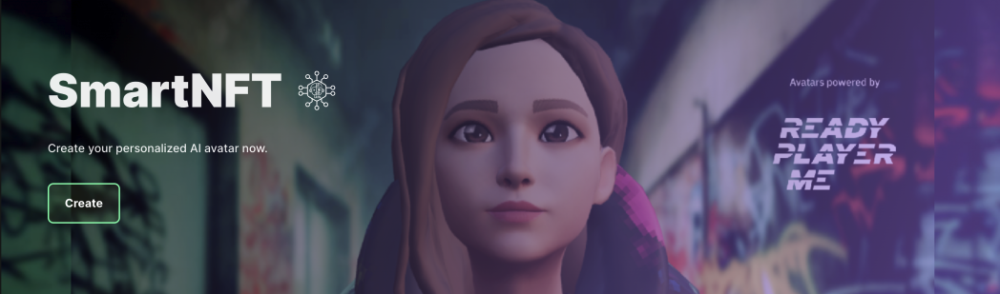

# 🤖 AIKO

**Introducing** **AIKO**

**Aiko is the first NFT Avatar from NFTEarth infused with AI powered by Google Vertex AI and ReadyPlayerMe Avatars.** \
\
**NFTs and AI can together create tremendous synergies, AIKO has been created to be the first NFT protocol in-app guide, digital companion, and resource to all users of the NFTEarth protocol.**

<figure><figcaption>
AIKO from NFTEarth
</figcaption></figure>

AIKO is designed to leverage the vast capabilities of LLMs in order to provide a fun and useful experience all contained within an NFT for users of the NFTEarth protocol. AIKO synthesizes human speech in order to generate a helpful response to any user query they may have.

.png>)

Users will be able to mint their own individual and customized NFTs, upgrade them over time for additional utility, and enjoy other benefits only available to NFT holders.&#x20;

<figure><figcaption>
Create a SmartNFT at NFTEarth
</figcaption></figure>
