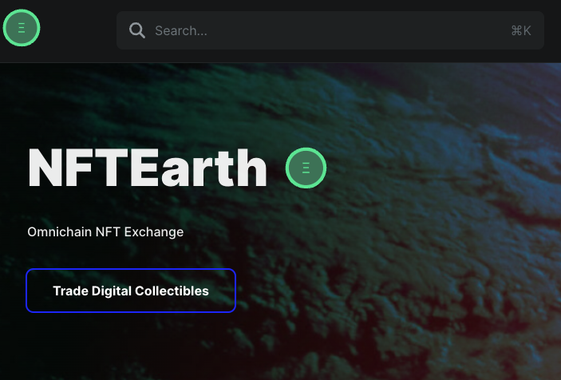

# 🎨 NFT Collections by NFTEarth

## LowFeeNFT

Mint `LowFeeNFT` on NFTEarth at this link: [Mint](https://nftearth.exchange/lowfeenft)

<figure><figcaption>
LowFeeNFT Collection - OpenEdition on Arbitrum Layer2 Network
</figcaption></figure>

Earn the Galxe Badge: NFTEarth NFT Minter on Arbitrum

As part of the relaunching of the Arbitrum Odyssey, the NFTEarth team has created an an NFT to celebrate Arbitrum and showcase the cost savings of minting NFTs on the layer2 network by deploying an OpenEdition ERC-721A NFT Contract that can be minted on Arbitrum, and the participants will earn a special badge on Galxe reflecting they completed the task. The Galxe badge NFT will only be claimable once the NFT has been minted on Arbitrum, and will be a form of onchain proof that the user has participated on the top L2 network to help kickstart NFT momentum.

Mint `LowFeeNFT` on NFTEarth at this link: [Mint](https://nftearth.exchange/lowfeenft)


What is the LowFeeNFT smart contract address on Arbitrum? \
\
The NFT contract address is: 0x010292d6de92d4fbcc110f277f55c143c023d723

View it on [Arbiscan](https://arbiscan.io/address/0x010292d6de92d4fbcc110f277f55c143c023d723)\
\
Trade the Earthlings NFT on [NFTEarth.](https://nftearth.exchange/arbitrum/collection/0x010292d6de92d4fbcc110f277f55c143c023d723)


Check out the LowFeeNFT Mission in the Arbitrum Odyssey Portal!&#x20;

## Earthlings

Earthlings are a collection of 3,131 NFTs from NFTEarth, consisting of entirely unique NFTs, created using generative AI technology on the Arbitrum L2 network. Designed to be dynamic, they are all 100% unique in their creation having been minted using generative AI technology, and they evolve over time based on conditional relationships that either are met, or not met, which have an impact on the NFT.

<figure><figcaption>
A unique Earthling NFT, 1 of 3,131 in total
</figcaption></figure>


What is the Earthling NFT smart contract address on Arbitrum? \
\
The NFT contract address is: 0x8778B7FD7e2480C6F9Ad1075Bd848B7Ce1b9d90C

View it on [Arbiscan](https://arbiscan.io/address/0x8778b7fd7e2480c6f9ad1075bd848b7ce1b9d90c)\
\
Trade the Earthlings NFT on [NFTEarth](https://nftearth.exchange/arbitrum/collection/0x8778b7fd7e2480c6f9ad1075bd848b7ce1b9d90c).

