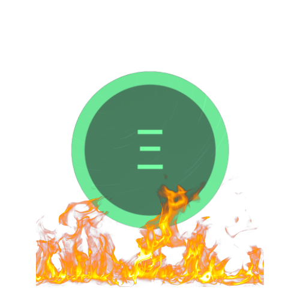

# 🔥 NFTE Burn Mechanism

Please see the article published by the NFTEarth team on Medium for details regarding the beginning implementation of the NFTE Burn Mechanism:



**NFTE Burn Transactions**

Burn Transactions on Arbitrum can be viewed on the Arbiscan block explorer here: [NFTE Burn Events](https://arbiscan.io/token/0x51b902f19a56f0c8e409a34a215ad2673edf3284?a=0x000000000000000000000000000000000000dEaD)&#x20;

<figure><figcaption>
NFTE Burn Mechanism
</figcaption></figure>


Burning is a common term used in web3 that means to reduce the overall circulating supply of a token, which in theory increases the value of the remaining supply of tokens due to the "burnt" tokens being removed forever from circulation. Being that the NFTE token is hardcapped at 100,000,000 tokens, each burn event makes the token more scarce.

