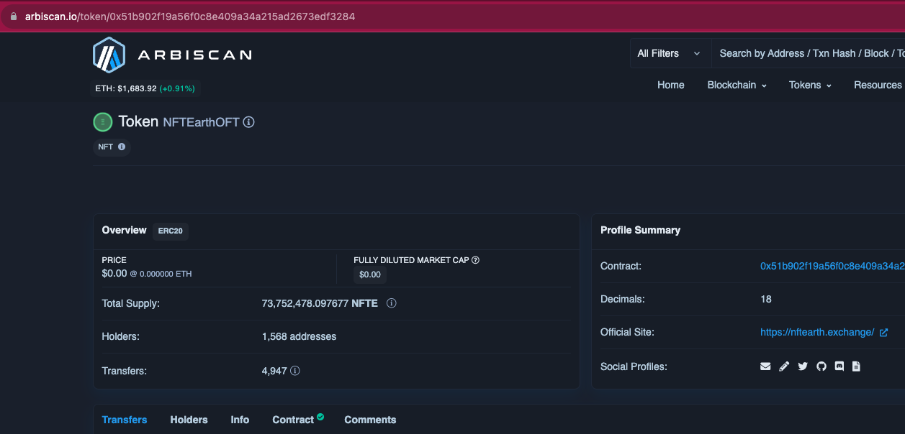

# 🌏 NFTE Token and Tokenomics

### NFTE Tokenomics

NFTE is the native utility token of the NFTEarth ecosystem. It is designed primarily to be used for staking, voting, and overall governance of the protocol.

NFTE is an ERC-20 token that leverages the LayerZero Omnichain Fungible Token (OFT) extension, which enables easy, fast, and secure bridging of NFTE cross-chain. NFTE is currently live on 9 chains - contract information can be found [here](../developers/contract-addresses.md).

### View NFTE Token Information on CoinGecko and CoinMarketCap:

CoinGecko: [https://www.coingecko.com/en/coins/nftearth](https://www.coingecko.com/en/coins/nftearth)

CoinMarketCap: [https://coinmarketcap.com/currencies/nftearth/](https://coinmarketcap.com/currencies/nftearth/)

### Tokenomics

| Total and Maximum Supply of NFTE   | 100,000,000 |
| ---------------------------------- | ----------- |
| Current Circulating Supply of NFTE | 100,000,000 |

### Token Allocation

| Category              | NFTE allocated                |
| --------------------- | ----------------------------- |
| Staking Rewards       | 20% of the total token supply |
| Liquidity             | 10% of the total token supply |
| Airdrop 1             | 8% of the total token supply  |
| Airdrop 2             | 6% of the total token supply  |
| Airdrop 3             | 6% of the total token supply  |
| Marketing             | 5% of the total token supply  |
| NFTEarth DAO Treasury | 5% of the total token supply  |
| NFTEarth Team         | 5% of the total token supply  |
| Reserve               | 15% of the total token supply |
| Advisors              | 20% of the total token supply |

<figure><figcaption>
NFTE Tokenomics
</figcaption></figure>

**What is the total supply / circulating supply / global supply?**&#x20;

* 100,000,000 (100 Million) NFTE tokens. The max supply and total supply of tokens have all been minted and in circulation, spread across the networks the protocol has deployed the token to.

**How can users quickly confirm NFTE tokenomic details using a block explorer?**

* Being that the NFTE token is an Omnichain token (OFT standard by LayerZero) - this can sometimes be a challenge for web3 data providers to stay current with in real-time, as the OFT standard is still a new and rapidly growing trend pioneered by LayerZero - the interoperability team that just announced a major partnership with Google Cloud. Until it becomes the norm for protocols to issue Omnichain tokens, an easy way to view the supply of NFTE on any chain in real-time is to view the token supply on each block explorer (such as [Arbiscan](https://arbiscan.io/token/0x51b902f19a56f0c8e409a34a215ad2673edf3284) - Arbitrum's main block explorer) to see what the current amount of tokens is. At any given moment in time, the total global max supply will always total - when summed across chains, to equal precisely 100,000,000 across all chains.&#x20;
* See below screenshot for an example: the largest amount of tokens are on Arbitrum in the screenshot, accounting for \~74% of the token supply at the time of the image. This will fluctuate based on how users choose to move their tokens cross-chain via the NFTEarth Bridge (built into the UI and powered by LayerZero) - or by users bridging their tokens via direct smart contract calls or using a block explorer directly.

<figure><figcaption>
NFTE on Arbitrum: view it directly on Arbiscan <a href="https://arbiscan.io/token/0x51b902f19a56f0c8e409a34a215ad2673edf3284">here: </a>
</figcaption></figure>
