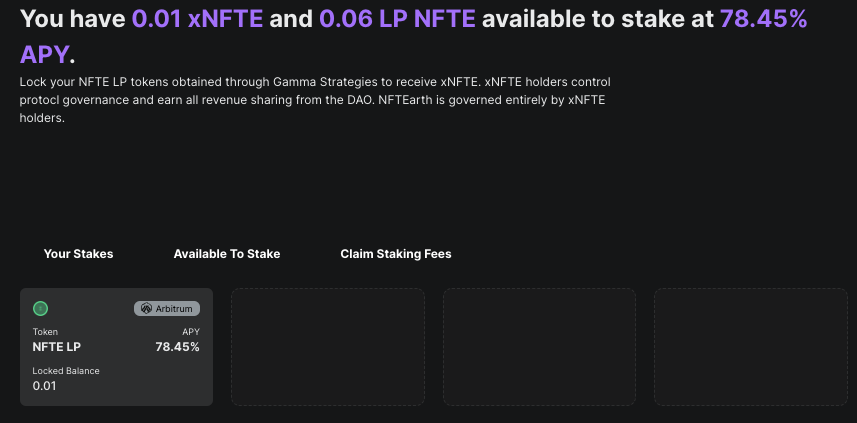
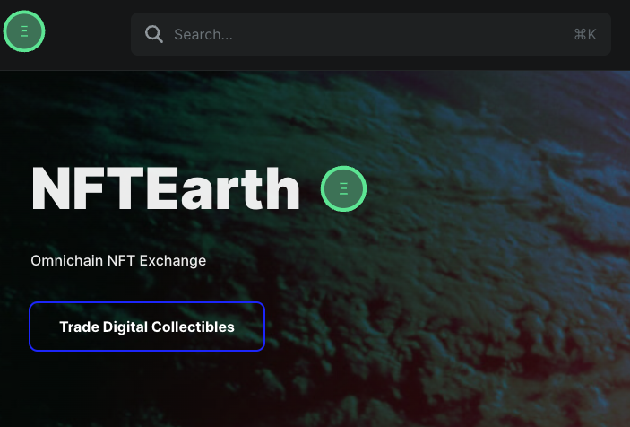

# 🚦 xNFTE and NFTE Staking

***

<figure><figcaption>
xNFTE
</figcaption></figure>

Staked NFTE (xNFTE) is the value accrual and governance mechanism being developed for the long-term benefit of NFTEarth protocol. The staking solution is a contract that lives onchain in the form of a non-transferable governance token issued to users who stake NFTE LP tokens into the NFTEarth staking contract. xNFTE is received as a receipt token, much like veCRV and veBAL are received from Curve and Balancer staking programs.&#x20;

xNFTE balances dictate voting power in both governance proposals and incentive direction on the NFTEarth Protocol and receive all rewards, protocol revenue, and future value accrual that is split with stakers and the DAO.

Please reference the Medium article published on specifics relating to xNFTE.

### The 3 Contracts That Make xNFTE Work:

**The 3 Contracts You Need To Understand to Grasp the xNFTE System:**

1. **Gamma Vault** (Tokenized NFTE / WETH LP Position) Contract Address: [0x82496243c0a1a39c5c6250bf0115c134ba76698c](https://arbiscan.io/address/0x82496243c0a1a39c5c6250bf0115c134ba76698c) on Arbitrum.
2. **xNFTE** Contract Address — where you deposit your NFTE LP position obtained from Gamma Strategies: [0xE57bd15448C3b2D1dBAD598775DD2F36F93EBf90](https://arbiscan.io/address/0xe57bd15448c3b2d1dbad598775dd2f36f93ebf90) on Arbitrum. Once deposited, you will have an xNFTE balance.
3. **FeeDistributor** — for xNFTE stakers to claim rewards - Contract Address: [0x9138a2e628f92a42397b3b600e86047ae49aca98](https://arbiscan.io/address/0x9138a2e628f92a42397b3b600e86047ae49aca98) on Arbitrum.

### What is xNFTE and How Does it Work?

For some context, it’s important to understand some of the most successful governance and value accrual tokenomic models that have been built in web3 up until now. Curve innovated with veCRV - pioneering the concept of locking up tokens, and it worked exceptionally well for them and kicked off a massive amount of protocols moving to a ve (vote-escrowed) model. Lock your CRV tokens and get veCRV, which earns you rewards and governance control. Balancer then innovated on what Curve built with veBAL, where instead of locking a single token, token holders lock a liquidity position (LP) consisting of BAL / WETH tokens — and they also changed the duration of max-time locking from veCRV down to 1 year. The change to an LP token as the locking token means that as more tokens get locked, \*liquidity increases\* which is a fundamentally innovative and massive competitive advantage for any protocol that implements it — and absolutely ideal for any protocol looking to bootstrap long-term liquidity. The results of this change speak for themselves. The BAL token is currently one of the single most liquid tokens in all of crypto, with its liquidity nearly equal to the market cap of the token. See the image below from DexScreener and check it out for yourself. With xNFTE, we aim to expand on this concept that Balancer implemented, with a couple of slight improvements. We will be using the leading decentralized exchange (DEX) by volume on Arbitrum — UniswapV3 — and additionally our staking contract is also deployed to Arbitrum layer2 as well, opposed to Ethereum Mainnet because of the lower costs of completing transactions on Arbitrum. This creates significantly more opportunities to attract new users interested in becoming part of the long-term vision of the protocol and taking part in protocol governance.

<figure><figcaption>
xNFTE in the NFTEarth UI
</figcaption></figure>

**So, why haven’t any other protocols done this? Especially any NFT protocols?**

First off, the trend towards this type of governance staking mechanism is clear. This is the direction that many protocols are looking to move to, and Balancer has even introduced an entire initiative aiming to onboard new protocols to this type of “Locked LP as governance” staking mechanism. The challenge with doing this with UniswapV3 positions is this: since they are created as ERC-721 NFTs — non-fungible tokens — this by default makes them inherently not composable with the type of staking contract designed for protocol revenue sharing based on staking by token holders — meaning these positions can’t be used to simply transfer into a staking contract, like what is possible with a UniswapV2 position.

So, enter AMM specialist [Gamma Strategies](https://gamma.xyx/). We’ve partnered with Gamma to help innovate past this obstacle in order to create composability and enable the deposit of UniswapV3 positions (in our case NFTE / WETH), by creating a tokenized representation of the NFT position which can then be staked for xNFTE. Innovation enabled. The depositor of the UniswapV3 position on Gamma Strategies receives in exchange for their deposit, an ERC-20 token which can then be used to be staked, thus solving the issue of composability. They can do this in a pre-determined and fixed liquidity range as well, making the entire staking mechanism discussed here possible.

As the goal for the NFTEarth staking mechanism is to expand liquidity, and not focus on optimization of fee capture, the positions created through Gamma are full-range UniswapV3 positions — which makes them function in a similar essence to UniswapV2 positions in terms of the weight of each token in the liquidity pool. So, what Gamma does explicitly is: enable the functionality desired (a transferrable representation of the pro-rata share of UniswapV3 LP position of NFTE / WETH to the xNFTE staking contract). Users can deposit directly to the NFTE / WETH position in the Gamma UI or via smart contract, and then the address that completes the deposit receives the token receipt that represents their amount of shares, pro-rata, to the total supplied in this unique LP NFTE / WETH UniswapV3 position. This token receipt created by Gamme is what is used for reliable bookkeeping as to always know which addresses own how many shares of the Vault, and consequently, the staked LP positions as well that determine the amount of xNFTE that any address possesses.

Important note: Users can still add to UniswapV3 pool for NFTE / WETH on Arbitrum outside of the Gamma Strategies partner protocol solution, or even create a position on Gamma and choose \*not\* to stake as well. NFTEarth is the first protocol to do this innovative UniswapV3 staking mechanism in web3, and also the first to do so on a layer2 network, enabling governance and value accrual for significantly more users than if deployed just on Ethereum Mainnet…where costs to create and add to positions is prohibitive for the vast majority of people around the Earth.


**In a single sentence, the more liquidity you provide and the longer time period you stake, the greater your rewards and governance power!**


<figure><figcaption>
Balancer Liquidity / MC - Image Courtesy of DexScreener
</figcaption></figure>

A user’s xNFTE balance is determined using the amount of NFTE LP (liquidity pool) tokens they have staked and the duration of the stake: staking more NFTE LP tokens for a longer duration will yield a larger xNFTE balance. This keeps voting power in the hands of users with the greatest commitment to the protocol’s long-term success.

Staked NFTE tokens cannot be redeemed from the contract until the end of the staking period. If a user claims their NFTE LP tokens at the end of the staking period, the associated xNFTE balance will be burned. Users can choose to extend the duration of their stake at any time.

NFTEarth is implementing the contracts used by Stargate Finance with their staking mechanism [veSTG](https://arbiscan.io/address/0xfBd849E6007f9BC3CC2D6Eb159c045B8dc660268) implementation on Arbitrum One as the staking contract and their [FeeDistributor](https://arbiscan.io/address/0xaf667811a7edcd5b0066cd4ca0da51637db76d09) as the rewards distribution mechanism.&#x20;

### Voting Power Calculation

A user’s xNFTE balance is a reflection of their voting power in the protocol. The xNFTE balance is computed based on two factors:

* Amount of NFTE LP tokens staked
* Duration of staking period

> **Example 1**\
> If two users stake the same amount of NFTE LP tokens on the same date, but select different end-dates for their stake, they will receive correspondingly different xNFTE balances. So, if Alice and Bob both stake 100 NFTE LP tokens on July 1, 2023, but Alice selects an end-date of July 1, 2024 and Bob selects an end-date of August 1, 2024, Bob will receive more xNFTE because his staking multiplier will be greater.
>
> **Example 2**
>
> If two users stake the same amount of NFTE LP tokens on different dates, but the end-date of their stake is the same, they will receive the same xNFTE balance. That is, if Alice stakes 100 NFTE LP tokens on July 1, 2023 and Bob stakes 100 NFTE LP tokens on July 1, 2024, but they both choose a staking period that ends on June 30, 2024, they will have the same xNFTE balance. This is because their 100 NFTE LP tokens are subject to the same multiplier.
>
> **Example 3**
>
> If two users stake the same amount of NFTE LP tokens and choose the same end-date, but then one of the users extends their staking period to a further end-date, that user will receive an increase to their xNFTE balance. That is, if Alice and Bob both stake 100 NFTE LP tokens on July 1, 2023 and both choose a staking period that ends on July 1, 2024, they will initially have the same xNFTE. But if Alice later extends her staking period to August 1, 2024, her xNFTE balance will increase because her staking multiplier will increase.

**Miscellaneous:**&#x20;

\
Over time, the voting power of older stakes will be diluted since new stakes will have higher multipliers applied to their xNFTE balance. **The best way to maximize your voting power and xNFTE balance is therefore to stake NFTE LP tokens for the maximum 1 year staking period and simply extend your staking period on a regular basis.**
