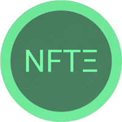

# 🎬 Media Assets

## Usage Guidelines:

* Use the NFTEarth logo in its original form.
* Do not place the logo on backgrounds that provide insufficient contrast.
* Do not stretch, compress, or add effects (like shadows or gradients) to the NFTEarth logo.
* Do not change or edit the colors in the NFTEarth logo.

## **NFTEarth Color Palette**

* Pastel Green: #6FE99A&#x20;
* Como: #4A7C5F&#x20;
* Silver Tree: #5DBC84
*   Aqua Forest: #59AD78

<figure><figcaption>
$NFTE Token Icon 200 x 200 .PNG
</figcaption></figure>

<figure><figcaption>
NFTEarth Icon 512 x 512 .PNG
</figcaption></figure>

<figure><figcaption>
NFTEarth Full Brand Logo 1024 x 1024 .PNG
</figcaption></figure>

<figure><figcaption>
$NFTE Token Icon 128 x 128 .PNG
</figcaption></figure>
