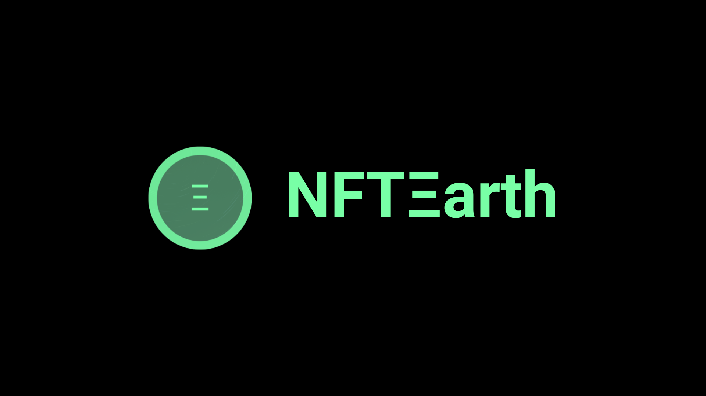

# 🎬 Brand Assets

Usage Guidelines

* Use the NFTEarth logo in its original form.
* Do not place the logo on backgrounds that provide insufficient contrast.
* Do not stretch, compress, or add effects (like shadows or gradients) to the NFTEarth logo.
* Do not change or edit the colors in the NFTEarth logo.

***

## **NFTEarth Color Palette**

### Colors

<table data-full-width="false"><thead><tr><th align="center">Color</th><th align="center">Hex</th></tr></thead><tbody><tr><td align="center">NFTEarth Green</td><td align="center">#79ffa8</td></tr><tr><td align="center">NFTEarth Purple</td><td align="center">#a879ff</td></tr><tr><td align="center">NFTEarth White</td><td align="center">#ffffff</td></tr><tr><td align="center">Pastel Green</td><td align="center">#6fe99a</td></tr><tr><td align="center">Aqua Forest</td><td align="center">#59ad78</td></tr><tr><td align="center">Como</td><td align="center">#4a7c5f</td></tr><tr><td align="center">NFTEarth Black</td><td align="center">#000000</td></tr></tbody></table>

<figure><figcaption>
NFTEarth Icon .PNG
</figcaption></figure>

<figure><figcaption>
1024 x 1024 PNG
</figcaption></figure>

<figure><figcaption>
1920 x 1080 Logo PNG
</figcaption></figure>
