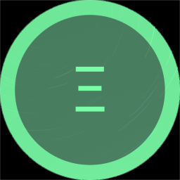

# 🎯 2023 Roadmap

<figure><figcaption>
NFTEarth Icon Mark
</figcaption></figure>

**First things first,** there are only 4,444 Earthlings. [Mint an Earthling](https://stake.nftearth.exchange) NFT now while they only cost .004444 $ETH to mint! You can go straight to the Mint page by scanning this QR code:

<figure><figcaption>
QR Code for convenient Earthling NFT Minting Access
</figcaption></figure>

## NFTEarth Community Update: Unveiling Our 2023 Roadmap

**Introduction:** Welcome, dear Earthlings and the NFTEarth community! As we embark on an exciting journey through 2023, we are thrilled to share our much-awaited roadmap with you. It's a roadmap that has evolved and will continue to evolve for the entirety of its existence. One thing remains unchanged though; our conviction in the potential impact that NFT technology; utilized through layer2 scaling solutions, can have on our Earth. At NFTEarth, we remain excited and enthusiastic in our commitment to revolutionizing the world of web3 technology and driving positive change for our planet by enabling access to users all over the world via NFTs. With your support, we are confident that this year will mark significant milestones for not just NFTEarth, but the Layer2 ecosystem in general... and in our vision to build a greener future for all. Let's dive into the key highlights of our 2023 roadmap!

1. Expanding Development Efforts: Our primary focus for 2023 is to build PRACTICAL and tangible development initiatives. We understand the critical role of innovation in creating sustainable solutions - and so we are ramping up our efforts to bring forth completely new solutions in the web3 space, such as mobile apps, native on both Android and iOS, Account Abstraction, and deploying on any major Layer2 network that has a strong base of users. By collaborating with leading experts and institutions, notably Google Cloud Platform, we aim to push the boundaries of this still nascent technology to enable access for a billion people to web3.
2. Launching the NFTEarth Innovation Rewards System: To support and empower aspiring NFT builders, creators, and contributors to the project, we are excited to share the launch of the NFTEarth Innovation System. This initiative is multi-faceted and combines a few components such as the Revenue Sharing program for the DAO - with aims to align the long-term interests of stakeholders and the protocol, and aspiring contributors, with aims to provide financial assistance, mentorship, and networking opportunities to budding community innovators who are dedicated to building a sustainable future for web3 protocols, and namely NFTEarth by aligning economic incentives for contributions. Through this effort, we hope to catalyze the growth of more innovative ideas that address on-boarding new users to web3, and specifically, finding NFTFi and other NFT related use cases for the NFTEarth protocol.
3. Significantly Enhancing the NFTEarth Platform: We recognize the importance of providing a robust and user-friendly platform for our community users and all potential users. Therefore, in 2023, we will be making significant upgrades to the NFTEarth platform - including the infrastructure, the type of applications served, and the target audience the DAO is aiming to reach at this point in time. These improvements will enhance user experience, streamline collaboration among community members via Discord and Zealy (and other engagement platforms), and facilitate the sharing of knowledge and resources. We are committed to creating an inclusive space in web3 - one that encourages meaningful engagement and nurtures the growth of sustainable initiatives. Our vision is to absolutely, 100% without a doubt, abstract away that scary word blockchain, so that Aunt Linda can enjoy using NFTs on the mobile; just like Nick the Nerd can on the latest Apple Silicon.&#x20;
4. Collaborating with Strategic Partners: Building strong partnerships is essential to long-term growth and sustainability. In 2023, we will actively seek collaborations with like-minded organizations, corporations, and DAOs. We believe that by pooling our collective expertise and resources in the NFT space, including most importantly our knowledge of the first-hand obstacles the NFT ecosystem is facing to reach adoption...that we can amplify our impact and accelerate the on-boarding of web3 users in a sustainable manner. By working together with partners, we can overcome the inevitable obstacles that lie ahead and pave the way for a brighter, more Earthly environment for web3 digital citizens.&#x20;

<figure><figcaption>
NFTEarth 2023 Ambitions. 
</figcaption></figure>

### Conclusion

As we embark on this transformative year as a young project, NFTEarth is more determined than ever to lead the way in L2 NFT innovation. Through our expanded development efforts, the launch of the NFTEarth Innovation Rewards System, platform enhancements, and strategic collaborations, we are poised to make significant strides toward building a successful project that rewards stakeholders and is a net-positive to the web3 ecosystem at large. We are immensely grateful for your continued support and are looking forward to BUIDLING this exciting vision! Together, let's create a world where decentralized technology thrives and everyone receives access to the technology they deserve as an Earthling! We are committed to navigating our way through the maze that is building out bleeding edge technological use cases. We are aware of the pitfalls in front of us. We are aware of the tremendous, almost unfathomable commercial opportunity that NFTs present to the internet of value and transforming countless industries by providing a source of verifiable digital ownership. And we are excited to keep BUIDLING together. LFGROW.&#x20;

\-NFTEarth, June 2023

